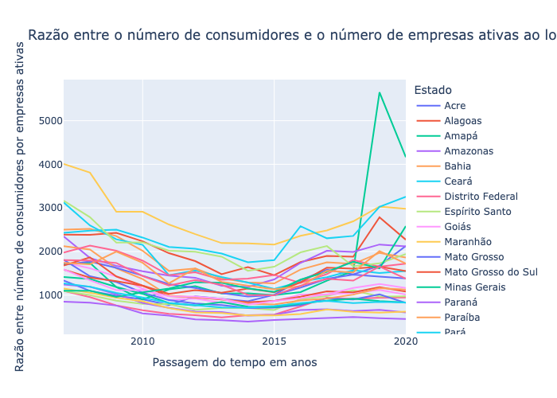
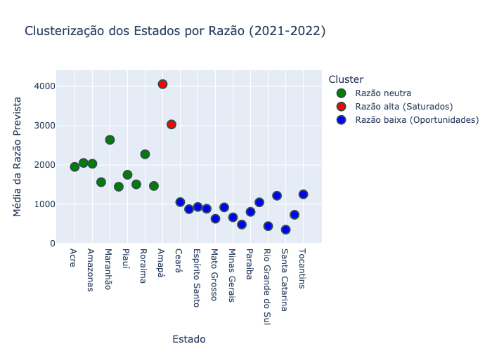

# Study Case

### Problem statement

According to SCOD Brazil, when analyzing the profile of real estate market consumers, it was observed that the predominant age group, approximately 50%, falls between 38 and 58 years old. Based on this, we would like a time series analysis from 2007 to 2022 of the ratio of consumers in this age group to the number of active companies per state.

Use data from 2007 to 2020 to estimate values for 2021 and 2022. Additionally, group the time series to identify which states exhibited similar trends. We are interested in determining which states are more saturated and which present greater future opportunities.

### Data sources

The required data can be found in the following sources:

1. **Business Data**: Available in SIDRA's "Table 1757 - General data of construction companies, according to employment size categories".
    - API Documentation: [SIDRA API](https://sidra.ibge.gov.br/Tabela/1757)

2. **Population Data**: Estimated population data can be found in the ["População por sexo e idade simples"](data/projecoes_2024_tab1_idade_simples.xlsx) table, which was downloaded on January 27th, 2025.
    - Source: [Population Projection](https://www.ibge.gov.br/estatisticas/sociais/populacao/9109-projecao-da-populacao.html)

## How to run the project

1. Clone the repository:
   ```sh
   git clone https://github.com/nataliatasso/time-series-study-case.git
   cd time-series-study-case
   ```

2. Make sure you have Python installed.
3. All the dependencies are listed on [requirements.txt](requirements.txt). They can be installed using:
    ```sh
    pip install -r requirements.txt
    ``` 

4. Run the main script:
    ```sh
    python case_study.py
    ``` 

# Análises (pt-br)

Ao importarmos os dados da SIDRA, verificamos que o banco de dados contém 378 observações, enquanto o do IBGE possui 9.009 observações. Observamos também que não há valores nulos em nenhuma das duas tabelas, o que dispensa a necessidade de tratamentos relacionados a esses dados. Contudo, algumas variáveis de interesse não estavam no formato (Dtype) desejado, e sua conversão será realizada durante a etapa de limpeza e junção das tabelas. Os dados estavam dispostos por faixas etárias simples, o que permitiu calcular diretamente a população na faixa etária de 38 a 58 anos.

Portanto, não foi necessário aplicar métodos de interpolação, uma vez que os dados já estavam no formato adequado para análise. Assim, as tabelas do IBGE e da SIDRA foram tratadas e unificadas conforme as variáveis de interesse.



Para ver por estado, verifique [Razão entre o número de consumidores e o número de empresas ativas ao longo dos anos, por estado](output/descriptiveAnalysisByState.png).

Em seguida, como nossa variável de agrupamento possui 27 categorias (representando os 27 estados), optamos por criar um gráfico para cada estado, com o objetivo de observar o comportamento individual de cada um, o que melhora a clareza da análise. Um ponto interessante observado foi que quase todos os estados apresentaram uma queda abrupta em 2014. Diversos fatores podem ter influenciado esse comportamento, incluindo a crise econômica daquele ano, que resultou em retração do PIB, aumento do desemprego e elevação da inflação, impactando negativamente o poder de compra da população, especialmente entre os consumidores da faixa etária analisada.

Fonte: [G1 - O auge e queda do mercado imobiliário em uma década](https://g1.globo.com/especial-publicitario/zap/imoveis/noticia/2016/04/o-auge-e-queda-do-mercado-imobiliario-em-uma-decada.html?utm_source=chatgpt.com)

Prosseguimos com as análises por meio da [decomposição sazonal](output/decomposicao/), a fim de separar a série temporal em componentes de tendência e resíduo. Como os dados são anuais, a sazonalidade não se aplica, mas a análise da tendência e dos resíduos é essencial para entender o comportamento da variável "RAZAO".

Conforme ilustrado nos [gráficos de tendência](output/previsao/), a razão apresentou considerável variabilidade entre 2007 e 2020, o que indicou que o modelo de previsão acomodou um erro significativo. Esse tipo de variação é comum em modelos de séries temporais, especialmente quando os dados flutuam consideravelmente, refletindo a influência de mudanças no contexto político e econômico.

Finalmente, investigamos como os estados se agrupam, com o intuito de identificar os mais saturados e os que apresentam maior potencial. A clusterização por K-Means foi utilizada para agrupar os estados com base na média da "RAZAO" prevista. No gráfico, os estados destacados em vermelho representam os mais saturados, enquanto os estados em azul indicam os menos saturados, com destaque para Santa Catarina, Rio Grande do Sul e Paraná. Os estados em verde refletem uma condição intermediária, com níveis moderados de saturação.


